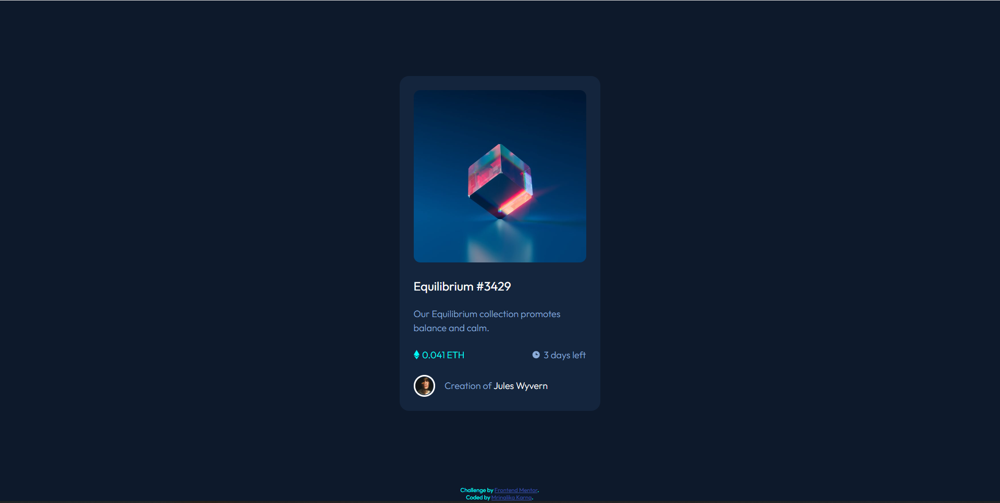

# Frontend Mentor - NFT preview card component solution

This is a solution to the [NFT preview card component challenge on Frontend Mentor](https://www.frontendmentor.io/challenges/nft-preview-card-component-SbdUL_w0U). 

## Overview

### The challenge

Users should be able to:

- View the optimal layout depending on their device's screen size
- See hover states for interactive elements

### Screenshot

### Links

- Solution URL: [https://github.com/MrinalikaKarna/MrinalikaKarna.github.io](https://github.com/MrinalikaKarna/MrinalikaKarna.github.io
- Live Site URL: [https://MrinalikaKarna.github.io](https://MrinalikaKarna.github.io)

## My process

### Built with

- Semantic HTML5 markup
- CSS custom properties
- Flexbox
- CSS Grid
- Mobile-first workflow

### What I learned

Image Overlay
## Author

- Frontend Mentor - [@MrinalikaKarna](https://www.frontendmentor.io/profile/MrinalikaKarna)

